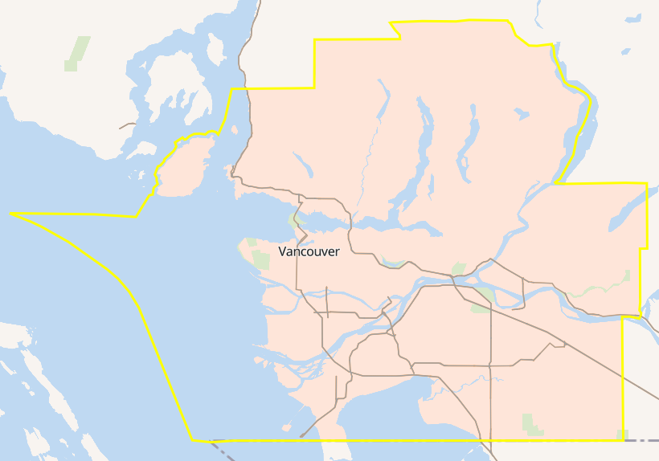
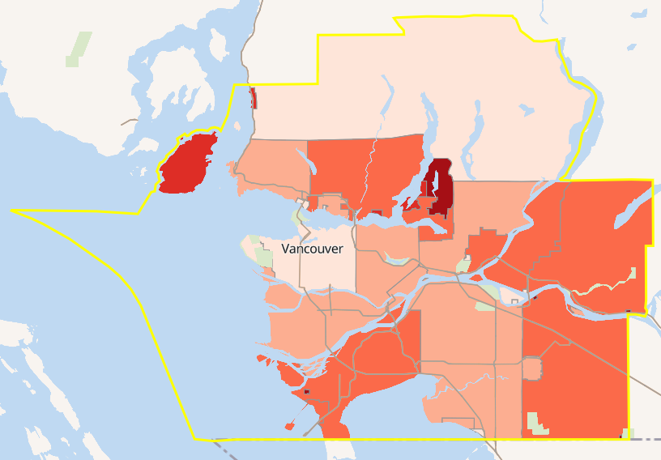
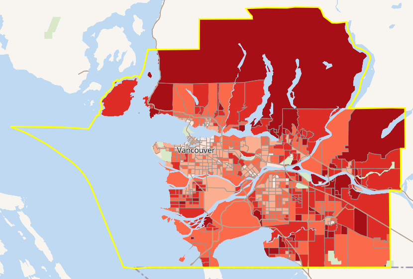
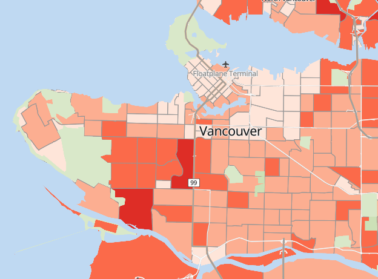
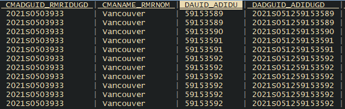
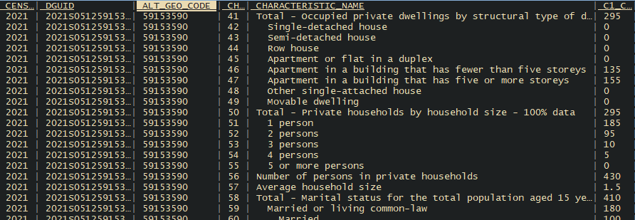
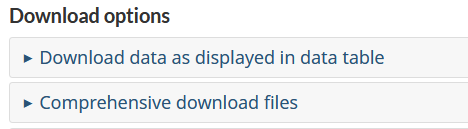
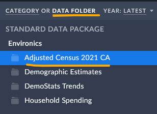
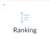

<!-- .slide: data-background="darkseagreen" -->

## Canada Census Data 
### 2021 Census of Population
\
\
Jeremy Buhler, Data Librarian\
UBC Library Research Commons\
[jeremy.buhler@ubc.ca](mailto:jeremy.buhler@ubc.ca)<!-- .element: class="smaller" --> 

notes: 

---

## Learning objectives  

- Understand how Census data is released
- Select appropriate Census geographies
- Know how to download Census data

notes: Session will be split into two parts. The first will introduce concepts and terminology that's helpful when working with Census data. THe second part will be a tour of some online resources for accessing data.

---

## Assumptions for this class

- Housing data for Vancouver neighbourhoods
- Analysis/GIS software is optional

note: ask students for show of hands
	- who has experience with data analytis software like SPSs, R, Python?
	- who has experience with GIS software?

We will not assume experience with either and will demonstrate how to work with StatCan data without this, but since some of you have experience we'll mention some additional resources that you might find useful 

---

<!-- .slide: data-background="lightblue" -->
## How Census data is released

- Aggregated data <!-- .element: class="fragment" -->
- Public Use Microdata File (PUMF) <!-- .element: class="fragment" -->

notes: **Aggregated data**, also referred to as statistics, is data that someone has already done some grouping or calculations on. Examples from the Census could include the population count for each neighbourhood in vancouver, the average income for a region, and so on. If aggregated data is already avaialble for the topic that interests you, this is usually the most efficient route. However, for some research projects aggregated data might not be available... in those cases you might want to look for...

**Public Use Microdata Files**, or PUMFS, are files that provide one row for _each person_. Microdata is useful because it provides a lot of detail, allowing you to build your own tables or conduct your own analysis.

We'll take a look at sources for each kind of Census data.

---

## Aggregated Census data

- Published tables
- Census profiles 
- Third-party vendors (e.g. SimplyAnalytics)

notes: These are three sources of aggregated data that we'll look at today. 

---

<!-- .slide: data-background="lightblue" style="font-size:0.8em" data-transition="slide-in fade-out" -->
## Census geographic levels

- Census division<!-- .element: class="fragment semi-fade-out" data-fragment-index="1" -->
- Census metropolitan area 
- Census subdivision
- Census tract
- Designated place<!-- .element: class="fragment semi-fade-out" data-fragment-index="1" -->
- Dissemination area
- Dissemination block<!-- .element: class="fragment semi-fade-out" data-fragment-index="1" -->

_<https://www150.statcan.gc.ca/n1/pub/92-195-x/92-195-x2021001-eng.htm>_ <!-- .element: class="small" -->

note: This is a partial list of the geographic areas referred to on Statistics Canada Census pages and in other StatCan products. The source, linked at the bottom of the slide, includes descriptions of each of the areas. For this clas I'm going to illustrate four frequently used Census geograpies. (Highlight, read 4). We'll look at each of these using Greater Vancouver as our example.

---

<!-- .slide: data-transition="fade" -->
### Census metropolitan area (CMA)

note: This is the _Census Metropolitan Area_ - or CMA - of Vancouver. Many of the Public Use Microdata Files (PUMFs) only provide data at the CMA level. But in this class I understand you're interesed in variation _within_ the Vancouver CMA.

---

<!-- .slide: data-transition="fade" -->
### Census subdivision (CSD)

note: The Census subdivision breaks the area down into smaller chunks

---

<!-- .slide: data-transition="fade" -->
### Census tract (CT)

 <!-- .element class="fragment semi-fade-out" data-fragment-index="1" -->
 <!-- .element class="fragment" style="position: absolute; left: 200px" data-fragment-index="1" -->

note: The Census tract breaks the area down into smaller chunks

---

<!-- .slide: data-transition="fade-in slide-out" -->
### Dissemination area (DA) 

note: The Dissemination area breaks the area down into smaller chunks. In the Vancouver CMA there are more than 500 dissemination areas.

---

<!-- .slide: data-background="lightblue" style="font-size:smaller"-->

Tour of Census resources on Statistics Canada website  
(_see notes for details_)

notes:
- Statcan page ->
- Census of population page (Census Data, Census Geography, Census Profile ->
- Census profile, search for Vancouver, choose CMA ->
- Show 'add a geography', show 'add/remove' as way to see scope
- Advance to 'household'
- Discuss download options
- Show slide about 
- Discuss geographic limits (no housing tables at DA level)
- Remove "Housing" filter, show geog filter for DA (6 tables only)
- Go to Census profile for DA data (Vancouver CMA)
- Census profile download (Comprehensive download at DA level, BC)
- File is 3.4GB and almost 23M rows
- Next slide

---

#### Geographic attribute file + profile download

 <!-- .element: class="fragment" -->
 <!-- .element: class="fragment" -->

---

<!-- .slide: data-background="lightblue" style="font-size:smaller"-->

Tour of Census Housing data on SimplyAnalytics  
(_see notes for details_)

notes:
- Open project for Canada, Vancouver CMA ->
- Leave default variables ->
- Show drop-down menus at top, go to CT, Zoom in to show DA change ->
- Remind that aggregator. Add variable by 'data folder' ->
- Choose Census ->
- Choose 'occupied private dwellings by tenure', show ownership percentage ->
- Add to map ->
- Export ranking table by DA

---

<!-- .slide: style="font-size:0.7em"-->
## Census profile download

1. From the [Census profile](https://www12.statcan.gc.ca/census-recensement/2021/dp-pd/prof/index.cfm>) page, select the desired location

2. Click _Download_ button (top right)

3. Select Download type
\

Use _Comprehensive download files_ to download data for more than five locations (select file with desired geographic level)

---

<!-- .slide: style="font-size:0.7em"-->
## Geographic attribute file

1. On the [Census geography](https://www12.statcan.gc.ca/census-recensement/2021/geo/index-eng.cfm) page click _Attribute information products_

2. Select _Geographic Attribute File_

3. Select a Census year and click _Continue_ to download

---

<!-- .slide: style="font-size:0.7em"-->
## SimplyAnalytics: tips

- Use drop-down menus above the map to change:
	- data shown in the map
	- geographic level (e.g. Census Tract, Census subdivision)

- Add data on the left (select _data folder_ to browse Census)
\

---

<!-- .slide: style="font-size:0.7em"-->
## SimplyAnalytics: download table 

1. In the right panel click _Ranking_ to display as table
\

2. Use drop-down menu above the table to change:
	- geographic level
	- number of geographies to display

3. Click _Export_ to download as Excel or CSV file

---

<!-- .slide: data-background="lightblue" style="font-size: 0.7em;" -->
## Selected resources 

- [Census of Population](https://www12.statcan.gc.ca/census-recensement/index-eng.cfm) main page 
- [Census Profile](https://www12.statcan.gc.ca/census-recensement/2021/dp-pd/prof/index.cfm) 
- [Illustrated Glossary of Census Geography](https://www150.statcan.gc.ca/n1/pub/92-195-x/92-195-x2021001-eng.htm) 
- [Geographic Attribute File](https://www12.statcan.gc.ca/census-recensement/2021/geo/aip-pia/attribute-attribs/index-eng.cfm) 
- [SimplyAnalytics](https://resources.library.ubc.ca/page.php?details=simplyanalytics&id=1044) UBC login page 
- [2021 Census PUMF](https://hdl.handle.net/11272.1/AB2/1WTDOP) in Abacus 

\
\
Data analysis/GIS workstations in [Digital Scholarship Lab](https://researchcommons.library.ubc.ca/digital-scholarship-workstations/) or by [remote login](https://remotelabs.ubc.ca/#group-1028-data)
\
\
Jeremy Buhler, Data Librarian [jeremy.buhler@ubc.ca](mailto:jeremy.buhler@ubc.ca)\
Paul Lesack, Data/GIS Analyst [paul.lesack@ubc.ca](mailto:paul.lesack@ubc.ca)

