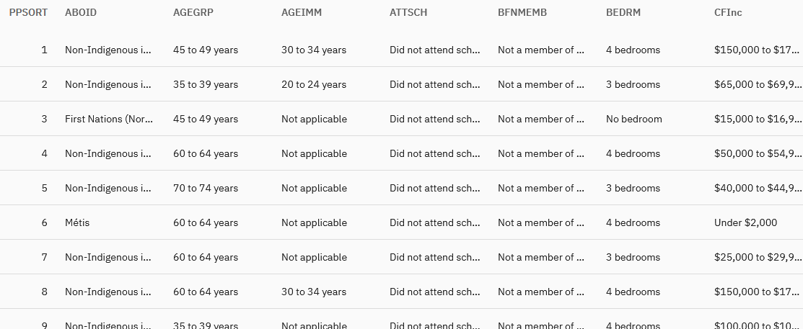

<!-- .slide: data-background="darkseagreen" -->

## Canada Census Data 
### 2021 Census of Population
\
\
Jeremy Buhler, Data Librarian, Koerner Library <!-- .element: class="smaller" --> 
\
Milan Simic, Reference Librarian, Koerner Library

notes: 

---

## Learning objectives  

- Understand how Census data is released
- Select appropriate Census geographies
- Know where to find Census data products

notes: Session will be split into two parts. The first will introduce concepts and terminology that's helpful when working with Census data. THe second part will be a tour of some online resources for accessing data.

---

## Assumptions for this class

- Data for Vancouver neighbourhoods
- Without specialized analysis/GIS software

note: ask students for show of hands
	- who has experience with data analytis software like SPSs, R, Python?
	- who has experience with GIS software?

We will not assume experience with either and will demonstrate how to work with StatCan data without this, but since some of you have experience we'll mention some additional resources that you might find useful 

---

<!-- .slide: data-background="lightblue" -->
## How Census data is released

- Aggregated data <!-- .element: class="fragment" -->
- Microdata <!-- .element: class="fragment" -->

notes: **Aggregated data**, also referred to as statistics, is data that someone has already done some grouping or calculations on. Examples from the Census could include the population count for each neighbourhood in vancouver, the average income for a region, and so on. If aggregated data is already avaialble for the topic that interests you, this is usually the most efficient route. However, for some research projects aggregated data might not be available... in those cases you might want to look for...

**Microdata** is data where you have a record or row for each observation - to use the Census as an example, that would be one row for _each person_. Microdata is useful because it provides a lot of detail, allowing you to build your own tables or conduct your own analysis.

We'll take a look at sources for each kind of Census data.

---

## Aggregated Census data

- Published tables
- Census profiles 
- Third-party vendors (e.g. SimplyAnalytics)

notes: These are three sources of aggregated data that we'll look at today. 

---

## Census microdata

- Public Use Microdata Files (PUMFs) 
- Case-level data
- A sample of the population (2.7%)
- Some variables removed/aggregated for privacy

 <!-- .element: class="fragment" --> 

notes: Census PUMF individuals file in Abacus. 981K records, 126 variables. Geographic data suppressed, only available to down to the CMA level for Vancouver. This makes it not useful for the analysis of Vancouver neighborhoods, but it's worth knowing about the place and potential of microdata, especially for other projects that might happen at a broader geographic level (like a comparison between provinces, or among Canada's major metropolitan areas)

---

<!-- .slide: data-background="lightblue" style="font-size:0.5em" data-transition="slide-in fade-out" -->
# Census geography

- Aggregated dissemination area
- Census agglomeration
- Census agricultural region
- Census division
- Census metropolitan area <!-- .element: class="fragment highlight-blue" data-fragment-index="1" -->
- Census subdivision<!-- .element: class="fragment highlight-blue" data-fragment-index="1" -->
- Census subdivision - previous census
- Census tract<!-- .element: class="fragment highlight-blue" data-fragment-index="1" -->
- Census consolidated subdivision
- Core, fringe and rural area
- Designated place
- Dissemination area<!-- .element: class="fragment highlight-blue" data-fragment-index="1" -->
- Dissemination block
- Economic region

_<https://www150.statcan.gc.ca/n1/pub/92-195-x/92-195-x2021001-eng.htm>_

note: This is a partial list of the geographic areas referred to on Statistics Canada Census pages and in other StatCan products. The source, linked at the bottom of the slide, includes descriptions of each of the areas. For this clas I'm going to illustrate four frequently used Census geograpies. (Highlight, read 4). We'll look at each of these using Greater Vancouver as our example.

---

<!-- .slide: data-transition="fade" -->
### Census metropolitan area (CMA)

note: This is the _Census Metropolitan Area_ - or CMA - of Vancouver. Many of the Public Use Microdata Files (PUMFs) only provide data at the CMA level. But in this class I understand you're interesed in variation _within_ the Vancouver CMA.

---

<!-- .slide: data-transition="fade" -->
### Census subdivision (CSD)

note: The Census subdivision breaks the area down into smaller chunks

---

<!-- .slide: data-transition="fade" -->
### Census tract (CT)

 <!-- .element class="fragment semi-fade-out" data-fragment-index="1" -->
 <!-- .element class="fragment" style="position: absolute; left: 200px" data-fragment-index="1" -->

note: The Census tract breaks the area down into smaller chunks

---

<!-- .slide: data-transition="fade-in slide-out" -->
### Dissemination area (DA) 

note: The Dissemination area breaks the area down into smaller chunks. In the Vancouver CMA there are more than 500 dissemination areas.

---

<!-- .slide: data-background="lightblue" style="font-size:smaller"-->

Tour of Census resources on Statistics Canada website  
(_see notes for details_)

notes:
- Main Census page
- data tables by topic (Housing)
- Census profile (for Vancouver CMA)
- Census profile download (including comprehensive download option)

---

<!-- .slide: data-background="lightblue" style="font-size:smaller"-->

Tour of Census Housing data on SimplyAnalytics  
(_see notes for details_)

notes:
- Open project for Canada, Vancouver CMA
- Leave default variables
- Select new housing variable, limit to Census
- Show variable metadata
- Change level of detail on map
- Show how to export table for selected variable

---

## Data tools

- Data Analysis: R, Python 
- Stata, SPSS
- OpenRefine
- Rich Data Services (for StatCan PUMFs)
 
(Add links for each)

---

<!-- .slide: data-background="darkseagreen" -->
## Questions?
