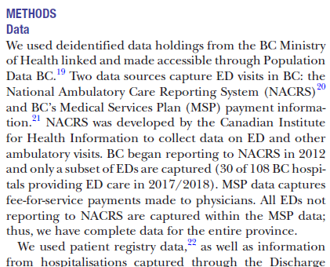
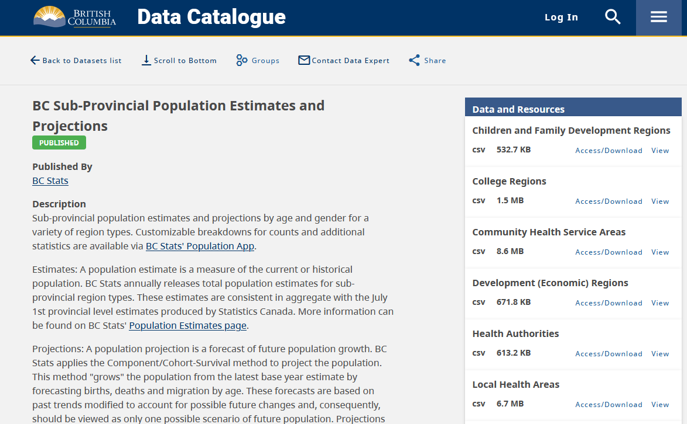

<!-- .slide: data-background="darkseagreen" -->

## Finding mental health data 
### Overview of sources
\
\
Jeremy Buhler, Data Librarian\
UBC Library Research Commons\
[jeremy.buhler@ubc.ca](mailto:jeremy.buhler@ubc.ca)<!-- .element: class="smaller" --> 

notes: 

---

<!-- .slide: data-background="seashell" -->

- Introduce some data search strategies
- Demonstrate potential data sources
- List resources for future reference 

Emphasis on Canadian sources available to UBC researchers <!-- .element: class="small" -->

notes: Mention assumptions. Limited to sources that are available to UBC researchers, emphasis on directly open but not good to limit oneself, therefore including PopData BC

---

<!-- .slide: data-background="seashell" -->

## What datasets do you use?
## Where do you look for data?

note: This is the engagement slide. Ask them to use the chat, possibly to place themseles on the screen 

We will not assume experience with any particular type or source of data. Many of you will already be familiar with some of what I share - my hope is that even for those with experience, there may be one or two ideas or tips that prove useful in the future.

---

<!-- .slide: data-background="seashell" -->
## General sources

- Data from other researchers <!-- .element: class="fragment semi-fade-out" data-fragment-index="1" --> 
- Statistics from agencies/organizations <!-- .element: class="fragment" data-fragment-index="1" -->
- Administrative data <!-- .element: class="fragment" -->
- Survey data <!-- .element: class="fragment" -->

notes:  BC Data catalogue has BC sub-provincial population estimates and projections (<https://catalogue.data.gov.bc.ca/dataset/bc-sub-provincial-population-estimates-and-projections>). Consider Show sidebar with health-related administrative boundaries.

---

<!-- .slide: data-background="seashell" -->

## Starting with literature search

Lavergne, M. R., Shirmaleki, M., Loyal, J. P., Jones, W., Nicholls, T. L., Schütz, C.,G., . . . Small, W. (2022). <b>Emergency department use for mental and substance use disorders: Descriptive analysis of population-based, linked administrative data in british columbia, canada.</b> BMJ Open, 12(1) <a href="doi:https://doi.org/10.1136/bmjopen-2021-057072">https://doi.org/10.1136/bmjopen-2021-057072<a/>

---

<ul>
<li>National Ambulatory Care Reporting System (NACRS)</li>
<li>Medical Services Plan (MSP)</li>
<li>Discharge Abstract Database (DAD)</li>
<li>...</li>
</ul>

---

<!-- .slide: data-background="seashell" -->
## Canadian administrative data

- [PopulationData BC](https://www.popdata.bc.ca/data_access) (BC)
- [Data Access Support Hub](https://www.hdrn.ca/en/dash/) (Multi-regional)

notes: these resources are gateways to data collected by provincial and national programs

---

<https://chspr.sites.olt.ubc.ca/files/2021/02/CHSPR-ED-Report-2021.pdf> <!-- .element: class="small" -->

notes: The article references this other paper with many of the same authors that describes the data sources. It's not published in journal but cited in the above paper and avaialable from website of the UBC Centre for Health Services and Policy Research: <https://chspr.sites.olt.ubc.ca/files/2021/02/CHSPR-ED-Report-2021.pdf> 

---

---

<!-- .slide: data-background="lightblue" -->
## Candian Survey and Census data

---

<!-- .slide: data-background="seashell" -->
## Statistics Canada

- Published tables <!-- .element: class="fragment" -->
- Public Use Microdata Files (PUMFs) <!-- .element: class="fragment" -->
- Research Data Centres (RDC) <!-- .element: class="fragment" -->

---

### StatCan: published tables

- Aggregated statistics
- Can lead back to data sources

[Start on statistics Canada home page](https://www150.statcan.gc.ca/n1/en/type/data) <!-- .element: class="small" -->

notes: On landing page, start with "mental health" search. Notice some unlikely hits - drill down by subject into "health" and select health characteristics table. 

---

### StatCan: PUMFs

- Case-level statistics (microdata)
- Some variables suppressed/grouped for privacy

[Start on Abacus, UBC Library's data repository](https://abacus.library.ubc.ca) <!-- .element: class="small" -->

notes: start with latest CCHS annual reference, after looking at table. Show that in the PUMF you can get the breakdown into smaller groups, as well as demographic information like (check and see which)

2002, 2012 Canadian community health survey, 2022 was MHACS (different name because different methodology - phone during COVID) but same questionnaire as previous iterations.

Sometimes you'll find relevant data in surveys that at first glance don't seem relevant. The Canadian Housing Survey asks a question about perceived mental health, along with questions about civic engagement and housing suitability.

---

### StatCan: Research Data Centre

- More detail than can be released to the public
- No cost for UBC researchers, but must apply
- Analysis in a secure facility at UBC Library 
- Access to datasets not available otherwise
	- e.g. [Longitudinal and International Study of Adults](https://www23.statcan.gc.ca/imdb/p2SV.pl?Function=getSurvey&SDDS=5144)

[See data available in RDC program](https://www.statcan.gc.ca/en/microdata/data-centres/data)<!-- .element: class="small" -->

note: so what do you do if you really need one of the variables that's aggregated or suppressed in the PUMF? For academic researchers one option is to apply for access to the data in a Research Data Centre. (At UBC there's one in Koerner Library). 

---

<!-- .slide: data-background="lightblue" -->
## Selected US resources

---

<!-- .slide: data-background="seashell" -->
### US resources: statistics

- [National Institute of Mental Health](https://www.nimh.nih.gov/health/statistics) 
- [CDC mental health data and statistics](https://www.cdc.gov/mentalhealth/data_publications/index.htm)
- [Substance Abuse and Mental Health Services Administration](https://www.samhsa.gov/data/)

notes: Most of what you'll find on these pages are aggregated statistics, not case-level data like we saw in the PUMFs above. However, they can still be useful even if you're looking for case-level data because they'll point you to the data source for the statistics. Take the National Institute of Mental Health as an example. 

---

<!-- .slide: data-background="seashell" -->
### US resources: surveys

- [ICPSR](https://resources.library.ubc.ca/page.php?details=inter-university-consortium-for-political-and-social-research&id=511) (access via UBC Library)
- [National Longitudinal Surveys](https://www.nlsinfo.org/)

notes: To introduce ICPSR we'll look for a longitudinal survey with the keywords "longitudinal study health". Among other results is the National Longitudional Study of Adolescent to Adult Health" with data from 1994-2018. There may well be other results here that are more relevant, but I'm going to choose this one to show a handy feature of the ISCPR catalogue. There are several tabs in the item record. The "At a glance" tab tells about the survey itself, and we learn that the survey "combines longitudinal survey data on respondents' social, economic, psychological, and physical well-being with contextual data on the family, neighborhood, community, school, friendships, peer groups, and romantic relationships."

The Data & documentation tab will provide more information about the contents, but the "Variables" tab can be a quick way to find out if there are relevant variables in the dataset. Here I'll try a search for 'disorder', and we see variables related to eating disorders, anxiety, PTSD.

---

<!-- .slide: data-background="darkseagreen" style="font-size: 0.7em;" -->
## Thank you
\
Jeremy Buhler, Data Librarian [jeremy.buhler@ubc.ca](mailto:jeremy.buhler@ubc.ca)

