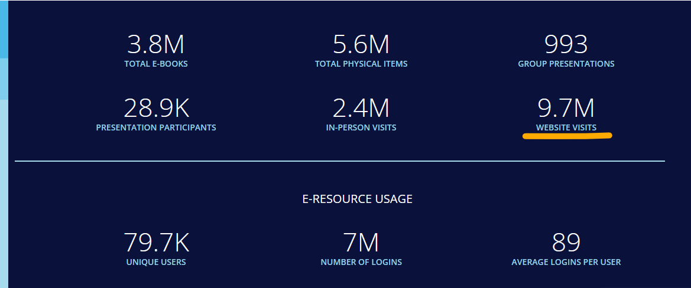
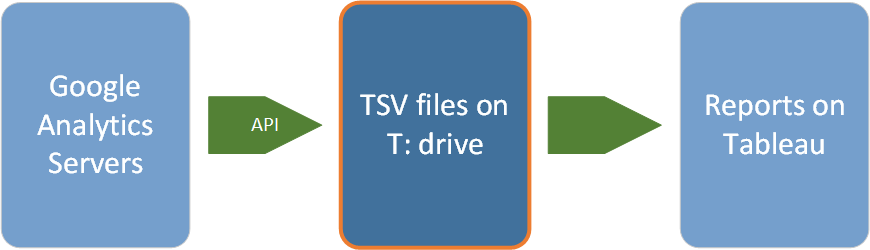
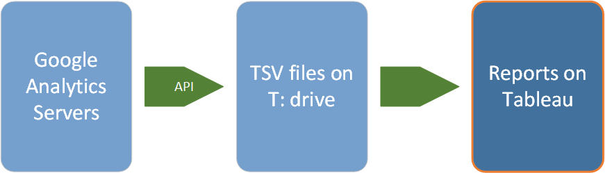

<!-- .slide: data-background="darkseagreen" data-transition="none" -->

## Website activity data 
### Google Analytics overview 
\
\
Library Data Team, UBC Library\
<https://confluence.it.ubc.ca/display/ASMNT/Library+Data+Home><!-- .element: class="small" --> 


notes: welcome, session will be recorded, introductions


---

<!-- .slide: data-background="seashell" data-transition="none-in slide-out" -->
### Library Data Team

- Jeremy Buhler, _Data Librarian_
- Brett Dimond, _Data Analyst and Curator_
- Meghan Waitt, _Library Data Analyst_

With help from TDUX and Library IT partners <!-- .element: class="fragment" style="color:darkgreen; font-style:italic" -->

---

<!-- .slide: data-background="seashell"  -->

### Session content

- What is Google Analytics?
- Google Analytics at UBC Library 
- Finding and using website activity data


notes: thank everyone for joining

---

<!-- .slide: data-background="seashell"  -->
### Additional resources in Confluence
<https://confluence.it.ubc.ca/display/ASMNT/About+Google+Analytics+data>

---

<!-- .slide: data-transition="slide-in zoom-out" -->

### 2022/2023 Senate Report



<https://about.library.ubc.ca/news/publications/senate-report-2022-2023/> <!-- .element: class="small" -->

notes:

---

<!-- .slide: data-background-image="media/overview_report.png" -->

notes: 

---

<!-- .slide: data-background="steelblue" data-transition="none-in fade-out" -->

## What is Google Analytics?


---

<!-- .slide: data-background="seashell" data-transition="fade-in slide-out" -->

Google Analytics (GA) is a web-based service that collects data about website activity 


notes: You don't need to understand Google Analytics well to access data about activity on UBC Library's websites, but it's helpful to have a broad understanding of how it works. What's actually happening when we say that Google Analytics "captures" website activity data? And what kind of data are we talking about, anyway?  

---

<!-- .slide: data-background="lightblue" --> 

## What does GA collect?


---

<!-- .slide: data-background="seashell" data-transition="slide-in zoom-out" -->

**Dimensions** provide context <span style="color:darkgreen; font-style:italic"><br/>which web pages? what browser?<br/><br/></span> <!-- ..element: class="fragment" -->
**Metrics** are quantitative measurements <span style="color:darkgreen; font-style:italic"><br/>how many pageviews? how many searches?</span> <!-- .element: class="fragment" -->


notes: Google Analytics groups the data it collects into two types: Dimensions and metrics. 
Dimensions provide context for the activity. What web page was viewed? What browser or operating system was the person using? How did the user get to that page?

Metrics are quantitative measurements, things you count to understand the volume of activity on the site. For example, howe many times were pages viewed on your site? How many sessions were there? How


---

<!-- .slide: style="font-size:0.6em; color:dimgray" data-transition="zoom-in fade-out" -->


| Dimension | Description |
| --- | --- | 
| Browser | _The browser used to view your website_    |
| Country | _The country from which the user activity originated_ | 
| Device category | _The type of device: desktop, tablet, or mobile_ |   
| Page location | _The full URL of web pages visited_ | 
| Session source | _The source from which traffic originated for a new session (e.g. google)_ | 
| Year month | _The year and month of the website activity_ | 

<https://confluence.it.ubc.ca/display/ASMNT/About+Google+Analytics+data> 

notes: Google Analytics collects literally hundreds of dimensions and metrics. This table shows just a few dimensions that are commonly used...

---

<!-- .slide: style="font-size:0.6em; color:dimgray" data-transition="fade" -->


| Metric | Description |
| --- | --- | 
| Session  | _Period of time during which a user interacts with the website or app_ | 
| Engaged sessions | _The number of sessions that lasted longer than 10 seconds, or had 2 or more screen views_ |
| Engagement rate | _The percentage of engaged sessions (engaged sessions divided by sessions)_ | 
| Event count | _The number of times an event is triggered on a website or app_ |
| Views | _Total number of app screens and/or web pages user saw_ | 

<https://confluence.it.ubc.ca/display/ASMNT/About+Google+Analytics+data> 

notes: ...and here are some metrics. 

---

<!-- .slide: data-background="seashell" data-transition="none-in slide-out" -->

Combine dimensions and metrics with insight and curiosity... 

...for a more meaningful representation of website activity <!-- .element class="fragment" -->


notes: if we understand how to combine metrics and dimensions to good effect, we can do things that are much more sophisticaed than session counts. Provide examples.  

---

<!-- .slide: data-background="lightblue"  -->

## How does GA collect the data?

notes:

---

<!-- .slide: data-background="seashell" data-transition="slide-in zoom-out" -->
 
<span>A <b>property</b> is a website, group of web pages, or app</span>

<span>Every property has a unique <b>tracking ID</b></span> <!-- .element: class="fragment" -->

<span>The tracking ID is added to <b>all pages in the property</b></span> <!-- .element: class="fragment" --> 

<span style="font-size:smaller;color:dimgray;font-style:italic"><br/>A web page can be in more than one property</span> <!-- .element: class="fragment" --> 

---

<!-- .slide: data-background-image="media/oc_homepage.png" style="font-size:0.7em" data-transition="zoom-in none-out" -->


<div style="background-color:white; height:20%;padding:7%">
<h4>Tracking ID for UBC Library website</h4>
<h3>G-CH28RE4DNT</h3>
</div> <!-- .element: class="fragment"  -->


```html [2,8] 
<!-- Google tag (gtag.js) -->
<script async src="https://www.googletagmanager.com/gtag/js?id=G-CH28RE4DNT"></script>
<script>
  window.dataLayer = window.dataLayer || [];
  function gtag(){dataLayer.push(arguments);}
  gtag('js', new Date());

  gtag('config', 'G-CH28RE4DNT');
</script>
```
<!-- .element: class="fragment" -->


<div style="background-color:white;color:dimgray;height:10%;padding:3%">
Plus a separate tracking ID for the <em>Open Collections</em> property</div> <!-- .element: class="fragment"  -->

notes: 

---

<!-- .slide: data-background="seashell" data-transition="none" -->

When users load a page, the tracking code sends website activity data to Google Analytics and links it to the relevant properties

---

<!-- .slide: data-background="steelblue" data-transition="none-in slide-out" -->

## Google Analytics at UBC Library 


notes: We'll answer three questions about UBC Library's implementation of Google Analytics:

- Who is involved?
- What websites are covered? 
- How do we handle the data?


---

<!-- .slide: data-background="lightblue" -->

## Who is involved?

---

<!-- .slide: data-background="seashell" -->

### Shared responsibilities

- Library Data Team <span style="color:darkgreen;font-style:italic">data access</span> <!-- .element: class="fragment" -->
- TDUX <span style="color:darkgreen;font-style:italic">service owner, accounts</span> <!-- .element: class="fragment" -->
- Library IT <span style="color:darkgreen;font-style:italic">implement/configure</span> <!-- .element: class="fragment" --> 


notes: 
The Library Data Team connects library employees with the website activity data they need for planning, decisions, and reports. We make data from Google Analytics accessible in Tableau reports designed to answer common questions, and we provide custom reports and data extracts when needed.
TDUX

TDUX is the service owner for website activity data. They articulate the Library's data collection strategy, which includes deciding what website activity data should be collected to meet current and future needs. Their decisions are grounded in use cases and informed by Library IT, the Library Data Team, and others who use website activity data.
Library IT

Library IT manages the implementation and configuration of Google Analytics in Library applications and websites reflecting service requirements set by TDUX, and uses analytics data to inform technical and project development and decision-making

---

<!-- .slide: data-background="lightblue" -->
## What websites are covered?

---

<!-- .slide: data-background="seashell" data-transition="slide-in zoom-out" -->

A **property** is a website, group of web pages, or app

UBC Library collects data for dozens of properties <!-- .element: class="fragment" -->


notes: a property is a website, group of web pages, or app for which 

---

<!-- .slide: data-background-image="media/woodward.png" -->

<div style="background-color:white; height:20%;padding:7%; color:dimgray">
<h4>Part of broader <em>UBC Library</em> property</h4>
<em>and</em>
<h4>has its own <em>Woodward Library</em> property</h4>
</div> <!-- .element: class="fragment"  -->

notes: Let's use one of the branch websites as an example. 

---

<!-- .slide: data-background="lightblue" data-transition="slide-in none-out" -->

## How do we manage the data? 

notes: Google collects the data, but there's some work involved to get it to you in a format that's easy to access and up to date.

---

<!-- .slide: data-transition="none" -->


---

<!-- .slide: data-transition="none-in zoom-out" -->


---

<!-- .slide: data-transition="zoom-in fade-out" data-background-image="media/tsv_view.png" -->


---

<!-- .slide: data-transition="fade-in zoom-out" -->


---

<!-- .slide: data-background-image="media/overview_report.png" data-transition="zoom-in none-out" -->

---


<!-- .slide: data-background="steelblue" data-transition="none"-->

## Finding and using website activity data 

notes: 

---

<!-- .slide: data-background="seashell" data-transition="none-in slide-out" -->

Three paths, _usually_ in this order

1. Use Google Analytics reports on Tableau <!-- .element: class="fragment" style="color:darkgreen" -->
2. Request a custom report <!-- .element: class="fragment" style="color:darkgreen" -->
3. Access the Google Analytics interface <!-- .element: class="fragment" style="color:darkgreen" -->


notes: There are three main paths to getting data

---

<!-- .slide: data-background="lightblue" -->

## Use Google Analytics reports on Tableau

---

<!-- .slide: data-background="seashell" -->

Designed to answer frequently asked questions


<ul style="color:darkgreen; font-style:italic">
<ul>
<li>where are visitors coming from?</li>
<li>what pages were viewed, and how often?</li> 
<li>what do people search for?</li>
</ul> <!-- .element: class="fragment" -->

---

<!-- .slide: data-background="seashell" data-transition="slide-in fade-out -->
### Links to reports on Tableau

- [Library website activity](https://reports.im.it.ubc.ca/#/site/Library/workbooks/6294/views) for current data
- [Library website activity - historical](https://reports.im.it.ubc.ca/#/site/Library/workbooks/6137/views) before 2023-07

---

_Live demonstration of current website activity report_

---

<!-- .slide: data-background="lightblue" -->

## Request a custom report 

Notes: we try to make the Tableau report informative and flexible enough to meet many needs for website activity data, but it's still only an overview.

---

Needs not met by Tableau reports? Submit a request using the [Library Data Team contact form](https://helpdesk.library.ubc.ca/request-for-library-datareporting-services/)

<https://helpdesk.library.ubc.ca/request-for-library-datareporting-services/> <!-- .element: class="small" -->

Notes: or if you have questions about what's possible or what's captured in Google Analytics, submit a request via the _Library Data Team contact form_

---

<!-- .slide: data-background="lightblue" -->

## Access the Google Analytics interface


notes: A third way to get Google Analytics data is to access the GA interface directly.

---

<!-- .slide: data-background="seashell" -->

**Advantage:** access all the data collected by Google Analytics (not just the subset in Tableau)

**Disadvantage:** must learn to use and interpret the Google Analtyics web interface

notes: When is a good time to do this?


---

## To request direct access to GA

1. Create a Google account linked to your _ubc.ca_ email address
2. Request GA access using the [TDUX contact form](https://helpdesk.library.ubc.ca/litmu/request-form/)


---

<!-- .slide: data-background="lightblue"  -->

### Additional resources in Confluence
<https://confluence.it.ubc.ca/display/ASMNT/Google+Analytics+reports+on+Tableau>

---

<!-- .slide: data-background="darkseagreen" data-transition="none" -->

# Thank you
