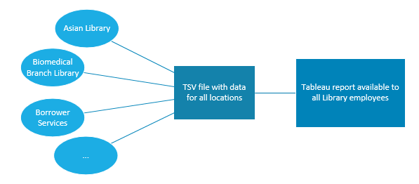

## UBC Library operational data 
### Overview for LIBR559S 
\
\
Jeremy Buhler, _Data Librarian_
Meghan Wait, _Library Data Analyst_

notes: Introductions 

---

## Session goals

A non-technical introduction to... 

- Types of operational data in academic libraries
- Value of this data in workflows and planning
- Making data available where it's needed
- Tools and skills that make this possible

notes:  

---

## What do we mean by operational data?

notes: list various kinds, distinguish from RDM and from data collected primarily for researchers (e.g. Abacus) 

---

## The Library Data Team

At UBC Library the **Library Data Team** is responsible for access to operational data, which includes:

- generating reports and data for Library employees in all branches/units
- compiling data for statistical surveys
- managing operational data collection
- maintaining data reporting platforms

Currently 1.5 FTE, providing support to all UBC Library branches

notes: At UBC Library, responsibility for collecting and providing access to library operational data, as well as for generating reports and completing statistical surveys, falls to the Library Data Team. Embedded in these bullet points are many other tasks related to maintenance, documentation, training, and workflow development.

---

## Example: Annual Report to Senate 

<https://about.library.ubc.ca/news/publications/senate-report-2022-2023/> <!-- .element: class="small" -->

notes: 

---

## Types of operational data

---

### Two channels for operational data creation 

- generated automatically by library systems, accounts, platforms
- collected/compiled by library employees

notes:

---

### Data generated automatically

Ask them to brainstorm, then show list on slide

- 
- 
- 

---

### Data compiled by employees

Similar to above, start by asking for ideas

-
-
-

---

## The value of operational data

- needed for external reporting
- valuable for internal planning, workflows, assessment

notes: new section, emphasis on why this work is important, who it benefits, etc. In each scenario, emphasize value of data for time-saving, reducing errors, better decision making, etc. Each example could include images to illustrate how we supported them: e.g. screenshot of a Tableau report, illustration of a data workflow. 

Ideal to split these slides between us. Scenarios focus on internal value

---

### Scenario 1

notes: a scenario where a library employee is faced with a large manual transcribing job, with data that's already

---

### Scenario 2

notes: another similar, but maybe a workflow

--- 

### Scenario 3

notes: an admin/planning example? Maybe something Sheldon's needed for budget/acquisitions?

---

## Data literacy/awareness is uneven

notes: it's obvious that there is data that can help in these scenarios, but that's not necessarily obvious to the people originally involved. With so many data sources (many obscure, behind the scenes), so many employees, and so much change in systems and workflows, it's easy to understand how someone might not realize that the Library Data Team can support them. A big part of our work is understanding library activities, developing relationships across the library, and paying attention to places where our work might be helpful.

---

## Out-of-the-box reports are limited

---

## Library Data Team's role as interpreter

- Library data team acts as a bridge between library operations/employees and the data.
- Involves work similar to reference interviews
- Requires understanding of the library context, as well as the technology/tools involved
- Help library employees understand what's possible

---

## Available to all library employees

notes: stress this isn't an admin unit, it's meant to be integrated into work at all levels, wherever it is helpful. On this slide also introduce Tableau as data distribution platform.

---

## New section: workflows

notes: examples of 2-3 workflows, each showing a different aspect. Collectively they should cover automatically generated data; data collected by employees; SQL; API; Tableau

---

## Workflow: Google Analytics

---
### Overview: what, why 

notes:

---

<!-- .slide: data-transition="none" -->

notes: This is a simplified representation of how the data gets from Google to you. The starting point is the Google Analytics Server where all the data is first collected.

---

<!-- .slide: data-transition="none-in zoom-out" -->

notes: at the end of every month the Library Data Team takes snapshots of the month's website activity and stores them in TSV files on the T: drive. This happens automatically with Python scripts that harvest selected dimensions and metrics using the Google Analytics API. We don't harvest all the data, but enough to answer many website activity questions.  

---

<!-- .slide: data-transition="zoom-in fade-out" data-background-image="media/tsv_view.png" -->

notes: These TSV files are stored in a T: drive directory that's visible to everyone. Some of the files are large (the pages file has more than 3M rows) and won't open in software like Excel, but they're available to anyone who wants to analyze the data themselves. 

---

<!-- .slide: data-transition="fade-in zoom-out" -->

notes: Most of us will prefer to move along to step three in the diagram, where these TSV files are turned into Tableau reports that are updated every month.

---

<!-- .slide: data-background-image="media/overview_report.png" data-transition="zoom-in none-out" -->

notes: here's an example of one of the Tableau dashboards. This one shows an overview of activity for the entire Library website from July 2023 to May 2024. Across the top you can filter by dimensions including the date, session source, device category, and medium. Even at a glance you can see that the overview graphs reflect the academic schedule, with a decrease in activity during the summer months and over the winter break.

---

<!-- .slide: data-background="seashell" data-transition="slide-in fade-out -->
### Links to reports on Tableau

- [Library website activity](https://reports.im.it.ubc.ca/#/site/Library/workbooks/6294/views) for current data
- [Library website activity - historical](https://reports.im.it.ubc.ca/#/site/Library/workbooks/6137/views) before 2023-07

notes: The two repors shown here are a good starting point. They have similar content but cover different time periods.

In 2023 Google Analytics underwent a major change, upgrading from a platform called _Universal Analytics_ to _Google Analytics 4_. This included changes to many dimensions and metrics, so it's important to use caution when comparing website activity from before and after July 2023. We've documented some of the differences on the Google Analytics pages in Confluence. If you have questions about comparing data over the long term, please consult these pages or contact the Library Data Team.

For many applications it's enough to use data from July 2023 onward, so in this presentation we'll focus on the current report.      

---

_Live demonstration of current website activity report_

notes: Load the report, step through each of the sheets in order, find a question for each

- About this report
- Overview
	- For the main UBC Library property, this is the only place to get the big picture for the entire UBCV Library website (but excludes UBCO).
	- Filter to 2024, exclude may (Winter term 2)
	- Show summary
	- Change to sessions
	- Notice that engagement rate is 56%, and that 5% of sessions are from US visitors
	- Limit to non-UBC LigGuides source
	- This subset of the activity is different. Engagement rate is higher (62% instead of 56) and the percentage and US visitors account for 21% of views, not 5%. We'd have to investigate more closely to know for sure, but this is likely because of LibGuides at US institutions linked UBC Library web pages.
- Searches
	- When a URL includes a search term - like what you see in the URL of search results pages - Google Analtyics records the term and counts the 'search' event. 
	- We can limit to searches run on just part of the Library site, identified by a hostname. The top line here represents searches at resources.library.ubc.ca. Filter to resource page searches.
	- expand the list of search terms to show grouping
	- search for 'date' to show 'uptodate', an indication that users are looking for a point-of-care medicine platform we don't have. It doesn't mean we should buy it, but perhaps there's a way to redirect these users to DynaMed, a similar platform that we _do_ subscribe to.
	- Remove 'date' search term
- Search terms
	- switch to cloud
	- this is another view of the research guides search terms
	- note that there's a filter for average searches per month to prevent the display from getting too cluttered with lesser-run searches. You might need to adjust this depending on other filter settings.
- Sessions
	- switch to Sessions tab. This dashboard (and many of the others) provides a more detailed look at other smaller properties. 
	- the date filter applies to the entire report, so this is pre-filtered to show Jan-April 2024. 
	- show the property name filter. Here you can choose the website you want to view. Change it to Asian Library. Again not surprisingly, the Asian Library has a higher percentage of international visits. On the UBC Library website overall, 82% of sessions are from users in Canada, but that's only 70% for the Asian Library website. 
	- Other graphs on this website are familiar from the overview tab 
- Page views
	- when branches are reviewing their websites they sometimes want to know which pages get the most traffic, or how much activity is associated with certain pages. The Page views tab can answer these questions.
	- Switch to techserv.library.ubc.ca
- 404 Page
	- Not a web crawler, but can help spot when users are repeatedly pointed to page that appears to be on a UBC site, but doesn't exist - or doesn't exist anymore.
- Properties and Pages
	- An administrative page that lists all the properties in the report along with counts of visited pages in each domain

---

### Scenario: LibInsight

---
## Tableau reports with LibInsight data

Scheduled data exports using LibInsight API

	
	

