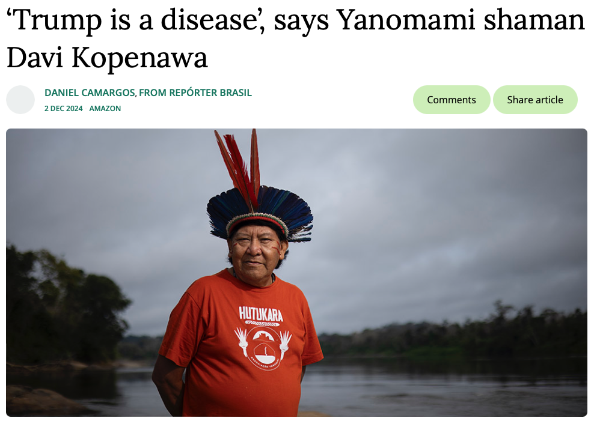
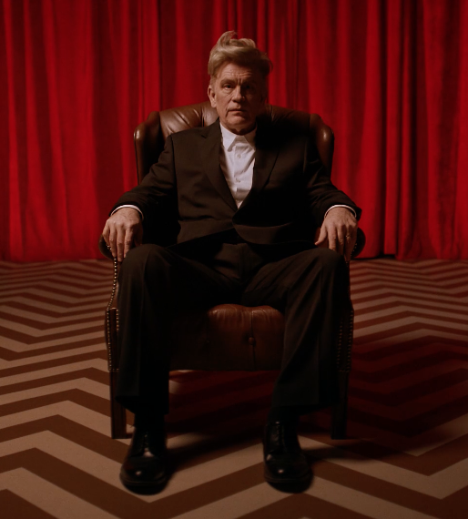
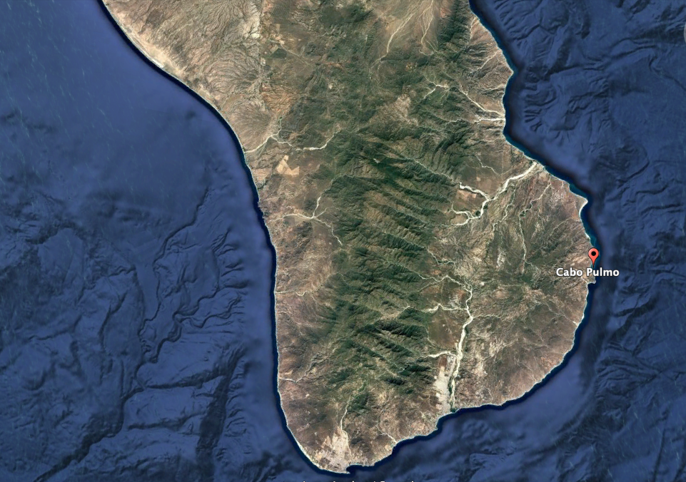
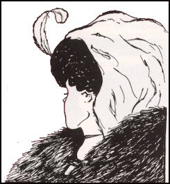
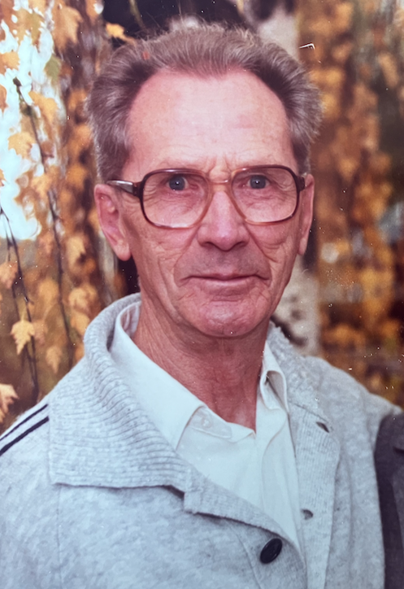

<!-- .slide: data-transition="none-out" data-background-color="DarkSeaGreen" -->

## Dreaming
### mimesis, enchantment, underworld 
\
\
Jeremy Buhler, _Data Librarian_   

notes: I've been reading an ethnography of the dream life of the Yanomami
- recently started affecting my own dreams, with dream journaling. 
- Much of the book is based on writings of Yanomami shaman Davi Kopenawa

---
<!-- .slide: data-transition="none-in slide-out" -->

 

notes: Here he is. As a shaman he has some deep know-how for dealing with disease

---
<!-- .slide: data-background-color="#906E3E" data-transition="none-in slide-out" -->

 

"They say I'm the greatest shaman now, nobody does it better, maybe they're right."

notes: But what happens if Trump is actually one step further than Kopenawa thinks: not the disease but a sorcerer in his own right? 

- This is a still from an AI generate video you might have come across on Youtube: Trump visits Peru and goes on an Ayahuasca journey. Goofy as a video
- But also reading this book (show book)
- Taussig quote from p36:  

"If we think of sorcery as a simplified term for [...] invisible maleficense - as with 'fake news'- then we can discern how a figure like Trump, buoyed up by the magic of the presidency, finds his mojo." 

And later: "The 'shamanic' element in all of this lay in the clouds of uncertainty and rumor"

---
<!-- .slide: data-background-color="black" data-transition="fade-in none-out" -->

__And then you are lost. He has eaten your soul.__ <!-- .element: class="fragment fade-in-then-out" -->

notes: We're unprotected, we don't know how to engage with this kind of sorcery. Taussig suggests that our language and imagery fail us when we most need them: all we know to say is "that's not right," but that is no protection in this context.   

Here's the ex director of the FBI: "Speaking rapid-fire with no spot for others to jump into the conversation, Mr. Trump makes everyone a co-conspirator to his preferred set of facts, or delusions. I have felt it - this president building with his words a web of alternative reality and busily wrapping it around all of us in the room... __And then you are lost. He has eaten your soul.__"

But how does this sould-eating sorcery work?
- two characteristics: metamorphosisi (things turning into other things) and mimesis (things multiplying in a destabilizing way)

---
<!-- .slide: data-background-color="goldenrod" -->

Words, he said, are like animals. Cut the pages and let the animals free. 

notes: 
First, the metamorphosis: everything in this unsettling world can transform. This quote is from burroughs. Cut the pages and let loose those transformed animals, creatures, whatever they are. But it's hard to tell what their agenda might be.

---
<!-- .slide: data-background-video="media/capibara.mov"  data-transition="none-in slide-out" -->

---
<!-- .slide: data-background-image="media/wara-wara.png" data-transition="none-in none-out" -->

Copies chasing copies as in spirit worlds, changing their form and hence the rules of the game.
 

notes: So metamorphosis is the first characteristic, the second is mimesis: "copies chacing copies as in spirit worlds, changing their form and hence the rules of the game" again to quote Taussig.

---
<!-- .slide: data-background-video="media/malkovich.mov"  data-transition="none-in slide-out" -->

 <!-- .element: class="fragment fade-in" -->

notes: just when you thought it was too much, there's another layer. This is John Malkovich as Kyle Maclaughlan playing agent cooper. 

---
<!-- .slide: data-background-image="media/we_live_inside.png"  -->

notes: We have to strengthen ourselves to handle the disorientation of these multiplie narratives. Where is our footing? 

This image is associated with Cyrus Reed Teed. Not the only one who believed that we actually live on the inside shell of a hollow earth.

---
<!-- .slide: data-background-image="media/we_live_inside.png" data-transition="none-in zoom-out"  -->

<video
  data-autoplay
  src="media/concave_convex.mov" width="40%">
</video> 

notes: Maybe delusion is organized and prevalent enough to be a kind of sorcery of its own, but more sinister: conspiracies and cabals replace the fairies and gelflings.

---
<!-- .slide: data-background-color="goldenrod" data-transition="zoom-in zoom-out" -->

notes: to counter this we need grounding, so I'll start with this piece of ground.
- where we're going soon
- jen and the dog boots
- the question: is digital earth any good for grounding, or is it already contaminated by the multiplicity inherent in the online environment. 

---
<!-- .slide: data-background-video="media/enchanted_earth.mov" data-transition="zoom-in none-out" -->

notes: so here's the experiment with Google Earth: find a spot in the foothills of the mountain range, look straight down and send your roots deep into the ground, then laungh Eastward into the mountains.

And through the mountains to the other side! A glitch in Google Earth? Or a glimpse of truth? We look for grounding and end up in this improbable space. So... is heaven above or below? 

---
<!-- .slide: data-background-color="black" data-transition="none-in fade-out" -->

notes: Who is more substantial or "real" in this picture? My dead grandmother resting unenbalmed in her coffin - lovingly made by some of her children - or the spectral figures Zooming in via the laptop to see her one last time? 

---

Q: Is it old or young?

A: Yes. <!-- .element: class="fragment"   -->

notes: One way out of these either/or comes via the bi-valent images brought by Gestalt. 
the answer is Yes.

---

 <!-- .element: class="fragment semi-fade-out" data-fragment-index="1" -->

Being is the interconnecteness, the resonant ecology, of things. <!-- .element: class="fragment" data-fragment-index="1" style="position: relative; top:-300px"  -->

notes: Describe Jan Zwicky
- perceptual impossibility to see both at the same time
- all we can do is switch between
- it is one AND it is the other
- wisdom comes from seeing_as, the flexibilty of metaphor, the experience of switching between more than the state of being in one or the other

---
<!-- .slide: data-background-image="media/inversion.png"  -->
I can only say, there we have been: but I cannot say where.

notes: Zwicky's approach doesn't anchor us anywhere, but it does point to a way to engage with continual reversal and surprise.

---
<!-- .slide: data-background-image="media/books.jpeg" data-transition="none-in none-out -->

notes: But it's good to have some tools for exploring. And if the landscape we need to explore is enchanted, maybe dreams can be the vehicles for our exploring. 

---
<!-- .slide: data-background-color="goldenrold" -->

# Lucid dream

notes: - what they are
- does anyone do it? 
- evidence to suggest that people who question the solidity of their reality in waking life can see through the apparent solidity of their dreams more regularly. 

---
<!-- .slide: data-background-color="goldenrod" -->
## Pre-lucidity checklist

- check your pockets for lint 
- are you wearing socks? 
- are there deer on the roof?

notes: personal experience
One of the things I want from lucid dreaming is to develop resilience in dream experience that sustains me when faced by impossible dream-logic in the real world. Read passage:

"Some lucid dreamers have in fact commented..." 

---
<!-- .slide: data-background-image="media/log_lady_malkovich.png" data-transition="none-in none-out -->

 <!-- .element: class="fragment fade-down" -->

notes: and maybe the ease in dreamland will make it easier for me to sit down at the table with someone like this: again John Malkovich, this time as the log lady. And also to enjoy this company across generations and time, with my dead grandfather revealing himself as I hadn't considered him before. 

---
<video style="position: relative; top:-230px"
  src="media/dream_chat.mov" controls="controls" height="1100px">
</video>

notes: can't fail to mention AI, which can only magnify the multiplicity and uncertainty of things.

---
<!-- .slide: data-background-image="media/djuna.jpeg" -->

## Round the mulberry we go... <!-- .element: style="color:white"  -->
