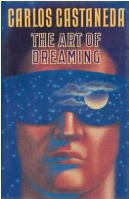

<!-- .slide: data-transition="none-out" data-background-color="DarkSeaGreen" -->

## Dreaming
### mimesis, enchantment, underworld 
\
\
Jeremy Buhler, _Data Librarian_   

notes: slide styles 
none	Switch backgrounds instantly
fade	Cross fade — default for background transitions
slide	Slide between backgrounds — default for slide transitions
convex	Slide at a convex angle
concave	Slide at a concave angle
zoom

---
<!-- .slide: data-transition="none-in slide-out" -->

 

notes:

---
<!-- .slide: data-background-color="#906E3E" data-transition="none-in slide-out" -->

 

"They say I'm the greatest shaman now, nobody does it better, maybe they're right."

notes: "If we think of sorcery as a simplified term for [...] invisible maleficense - as with 'fake news' or, more to the point, the attribution of 'fake news' - then we can discern how a figure like Trump, buoyed up by the magic of the presidency ('In God We Trust'), finds his mojo."

"This multiplicity of stories destabilized me and the moorings that [...] I thought I required for sociological reckoning." (p36). "The 'shamanic' element in all of this lay in the clouds of uncertainty and rumor" (p37)

"For those who oppose this tooth and nail it seems that language and imagery fail us when we most need them, and do so spectacularly in a liberal, secular environment." (p40)

We're unprotected, we don't know how to engage with this kind of sorcery.  

---
<!-- .slide: data-background-color="black" data-transition="fade-in none-out" -->

__And then you are lost. He has eaten your soul.__ <!-- .element: class="fragment fade-in-then-out" -->

notes: "Speaking rapid-fire with no spot for others to jump into the conversation, Mr. Trump makes everyone a co-conspirator to his preferred set of facts, or delusions. I have felt it - this president building with his words a web of alternative reality and busily wrapping it around all of us in the room... __And then you are lost. He has eaten your soul.__"

conspiracy theories as parallel universes, like the worlds colliding in the description of shamanism from Taussig. Note about AI taught on this parallel material - our uneasiness with it.

---
<!-- .slide: data-background-color="goldenrod" -->

Words, he said, are like animals. Cut the pages and let the animals free. <!-- .element: class="fragment"  -->

notes: this is somewhat abstract, but we can also think of sorcery in terms of two characteristics: metamorphosis (the shaman turning into someone else to take care of something), and mimesis (the multiplication by mirroring, representation, imitation - but raised to the nth degree by reproduction in the online world.

This quote is from burroughts. Let it go and see what happens. 

---
<!-- .slide: data-background-video="media/capibara.mov"  data-transition="none-in slide-out" -->

---
<!-- .slide: data-background-image="media/wara-wara.png" data-transition="none-in none-out" -->

Copies chasing copies as in spirit worlds, changing their form and hence the rules of the game.
 

---
<!-- .slide: data-background-video="media/malkovich.mov"  data-transition="none-in slide-out" -->

 <!-- .element: class="fragment fade-in" -->

notes: From Bergman "No form of art goes beyond ordinary consciousness as film does, straight to our emotions, deep into the twilight room of the soul." 
But Bergman is also aware that there's risk in this territory.

---
<!-- .slide: data-background-image="media/we_live_inside.png"  -->

notes: We have to strengthen ourselves agains that risk and disorientation to inhabit a world that's no longer academically drained of spirit, but where the reinchantments are decidedly more sinister. Where once were fairies and elves and gelflings, now we have consipiracy theories and cabals. 

---
<!-- .slide: data-background-image="media/we_live_inside.png" data-transition="none-in zoom-out"  -->

<video
  data-autoplay
  src="media/concave_convex.mov" width="40%">
</video> 

notes: 

---
<!-- .slide: data-background-color="goldenrod" data-transition="zoom-in zoom-out" -->

notes: we need grounding, so I'll start with this piece of ground. Jen woke up yesterday morning talking about how some dogs like wearing boots and some don't because they can't feel the ground, they lose touch with the world. 

---
<!-- .slide: data-background-video="media/enchanted_earth.mov" data-transition="zoom-in none-out" -->

notes: I decided to ground deeply into our digital _representations_ of the world to orient to the new landscape. Here's what I found.

---
<!-- .slide: data-background-color="black" data-transition="none-in fade-out" -->

notes: So is heaven above or below? Who is more substantial or "real" in this picture? My dead grandmother resting unenbalmed in her coffin - lovingly made by some of her children - or the spectral figures Zooming in via the laptop to see her one last time? In Daniel Kopenawa's description of Yanomami dream life, the dead are partying all the time and appear in peoples dreams to encourage the living to join them on the other side...

---
<!-- .slide: data-auto-animate data-background-color="black" data-transition="fade-in none-out" -->

underworld 

notes: in what we might call the underworld if we weren't already thrown off balance by that Google Earth discovery. 

---
<!-- .slide: data-auto-animate data-background-color="black" data-transition="none-in fade-out" -->

[under|other]world 

notes: Maybe it's just an otherworld. But as I noted before, those of us living in the disenchanted world of secular liberalism - particulary in academia - might entertain multiplicity without really embracing it. We use the square brackets to show that we know whats going on. I'd suggest those brackets might also be a stress response to multiplicity, bringing it into a smaller frame that's easier to control and deal with. 

---

Q: Is it old or young?

A: Yes. <!-- .element: class="fragment"   -->

notes: Multiplicity and 

---

 <!-- .element: class="fragment semi-fade-out" data-fragment-index="1" -->

Being is the interconnecteness, the resonant ecology, of things. <!-- .element: class="fragment" data-fragment-index="1" style="position: relative; top:-300px"  -->

notes: read from zwicky

---
<!-- .slide: data-background-image="media/inversion.png"  -->
I can only say, there we have been: but I cannot say where.

notes: "something else comes into play with re-enchantment, something that makes us perk up, listen more, see more, be aware like never before as to what is happening. The world acquires strangeness and we start exploring like when we were kids."

---
<!-- .slide: data-background-image="media/books.jpeg" data-transition="none-in none-out -->

 <!-- .element: class="fragment fade-down" -->

---
<!-- .slide: data-background-color="goldenrold" -->

# Lucid dream

---
<!-- .slide: data-background-color="goldenrod" -->
## Safety checklist

- check your pockets for lint <!-- .element: class="fragment" -->
- are you wearing socks? <!-- .element: class="fragment" -->
- find something to read <!-- .element: class="fragment" -->

---
<!-- .slide: data-background-image="media/log_lady_malkovich.png" data-transition="none-in none-out -->

 <!-- .element: class="fragment fade-down" -->

---
<video style="position: relative; top:-230px"
  src="media/dream_chat.mov" controls="controls" height="1100px">
</video> 
